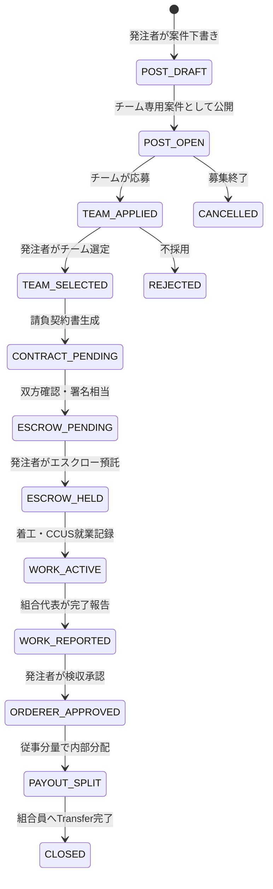

# チーム・労働者協同組合 設計正本（A→B→C）

> **前提**：画面実装は §19.7 弁護士ゲート通過後。本書は設計・スキーマ・契約フローの正本。  
> 関連：[`SPEC.md`](./SPEC.md) §15④（二軌制）・§19・§6.4（逓減手数料）・`functions/escrow.js`

---

## 0. 設計の原則（リスク回避 × 手数料）

| 原則 | 内容 |
|---|---|
| **契約当事者の明確化** | 軌道2では**労働者協同組合（法人格）**が発注者と直接請負。Zaibaseは当事者ではない |
| **手数料の性質** | **職業紹介手数料ではなく**「請負マッチング・プラットフォーム利用料」（発注者負担・請負金額に対する逓減率） |
| **軌道の分離** | `lawScheme: scheme_b`（個人）と `coop_track2`（組合）をデータ・UI・契約書で混同しない |
| **法人化ゲート** | `legalStatus !== registered_coop` のチームは**軌道2の正式契約不可**（β共同受注のみ） |
| **分配の根拠** | 組合内は**従事分量配当**（出資比例配当は不可）。CCUS・稼働記録を算定根拠に残す |
| **資金フロー** | 発注者 → Stripeエスクロー → **組合のConnect口座** → 組合内分配（Functions経由） |

---

## (A) 共同受注の契約フロー

### A.1 登場人物と契約関係

```
発注者（1次下請・専門工事発注者）  ※多層の場合は [`subcontract-chain-design.md`](./subcontract-chain-design.md) 参照
    │
    │ 工事請負契約（当事者） tierLevel=2 想定
    ▼
労働者協同組合 ◄─── Zaibase（透明性の担保者・証跡・決済インフラ。中間業者ではない）
    │
    │ 従事分量配当 / 組合内労務（組合の内規・社労士領域）
    ▼
組合員A・B・C…（各一人親方）
```

**Zaibaseが取れる手数料（発注者から）**

| 料金 | 率 | 法的ラベル（契約書・利用規約） |
|---|---|---|
| マッチング手数料 | §6.4 逓減（2.5〜8%） | 請負契約成立の**プラットフォーム利用料** |
| エスクロー管理料 | +1〜2%（§6.7） | 決済代行・預託管理料（Stripe Connect経由） |
| 最低手数料 | ¥3,000/件（請負） | 同上 |

**取らない／禁止設計**

- 組合員の賃金・配当から**職業紹介手数料**を徴収しない（職安法・建設業除外）
- 出資口数に比例した**配当計算**をシステムが行わない（非営利法人）

### A.2 状態遷移（ステートマシン）



### A.3 画面フロー（7画面）

| Step | 画面ID（予定） | 操作者 | 処理 |
|---|---|---|---|
| 1 | `jobPostScreen` 拡張 | 発注者 | 「チーム・組合向け案件」ON、最低報酬¥500万、必要人数、工種 |
| 2 | `teamJobBoard` | 組合代表 | チーム専用案件一覧・応募 |
| 3 | `teamJobReview` | 発注者 | 応募チームの信用スコア・実績比較・選定 |
| 4 | `teamContractScreen` | 双方 | 請負契約書。**受託者＝組合の正式名称**（個人名不可） |
| 5 | `teamEscrowScreen` | 発注者 | 報酬＋プラットフォーム手数料を預託（既存 `createEscrow` 拡張） |
| 6 | `teamWorkScreen` | 組合員 | CCUS/顔認証で就業記録（既存連携） |
| 7 | `teamPayoutScreen` | 組合代表→発注者 | 従事分量確認→検収→内部分配承認 |

### A.4 Step-by-Step 詳細

#### Step 1：発注者がチーム専用案件を登録

**入力（`helpPosts` 拡張）**

- `bidType: 'team_only'`
- `rewardAmount` ≥ ¥500,000（推奨下限。§6.4の逓減が効く帯）
- `requiredHeadcount`（5〜20）
- `requiredTrades[]`
- `lawScheme: 'coop_track2'`（固定）

**リスク回避チェック（サーバー／UI）**

- [ ] 時給・日当・雇用キーワードブロック（既存 `validateShamContractingPost`）
- [ ] 発注者が「特定の個人職人」を指名できない（チーム単位のみ）
- [ ] 偽装請負確認チェック（既存 `jpAgreeSham` 相当）

#### Step 2：チームが応募

**前提ゲート**

| `teams.legalStatus` | できること |
|---|---|
| `informal` | **応募不可**（軌道2）。結成・メンバー募集のみ |
| `forming` | 応募不可。設立チェックリスト進行中 |
| `registered_coop` | **応募可**。登記番号・代表者必須 |

**作成データ**：`teamApplications` ドキュメント

- `status: pending`
- `proposedHeadcount`, `proposedSchedule`, `message`
- `teamScoreSnapshot`（応募時点の信用スコア）

#### Step 3：発注者がチームを選定

- チームプロフィール：`teamScore`, `completedJobs`, `ccusTotalDays`, レビュー平均
- 選定 → `teamApplications.status = selected`、他は `rejected`
- `helpPosts.selectedTeamId`, `status: matched`

#### Step 4：請負契約書の生成（核心）

**既存 `generateContractFromChat` の組合版**。差分：

| フィールド | 個人（現行） | 組合（軌道2） |
|---|---|---|
| `contractorType` | `individual` | `labor_coop` |
| `contractorId` | 職人uid | **`teamId`** |
| `contractorLegalName` | 屋号 | **組合の登記名称** |
| `contractorRepresentativeUid` | 同左 | 組合代表者uid |
| `participants` | [orderer, contractor] | [orderer, representativeUid] + teamId参照 |
| `lawScheme` | `scheme_b` | `coop_track2` |
| 契約書表記 | 一人親方 | **労働者協同組合（法人）** |

**契約書に必須の条項（弁護士ドラフト前提）**

1. 受託者は労働者協同組合であり、組合員が従事する旨
2. 発注者は組合員個人に直接指揮命令しない（組合代表経由）
3. Zaibaseは契約当事者ではなくプラットフォーム提供者である旨
4. プラットフォーム利用料は発注者負担・請負金額に対する逓減率である旨
5. 組合内の従事分量配当は組合の内規に従いZaibaseは関与しない旨

#### Step 5：エスクロー預託（手数料徴収ポイント）

```
発注者の支払総額 = rewardAmount + platformFeeAmount + escrowFeeAmount
```

**計算（`calcTeamPlatformFee` — Functions正本）**

```javascript
// 請負金額（税抜）に対する逓減（SPEC §6.4）
function tieredRate(amount) {
  if (amount >= 20_000_000) return 0.025;
  if (amount >= 5_000_000) return 0.04;
  if (amount >= 1_000_000) return 0.05;
  return 0.08;
}
// Pro/Max: rate -= 0.005 / 0.01
// platformFeeAmount = max(rewardAmount * rate, 3000)
// escrowFeeAmount = rewardAmount * 0.01  // §6.7
// totalCharge = rewardAmount + platformFeeAmount + escrowFeeAmount
```

**Stripe Connect**

- `transfer_data.destination` = **`teams.stripeConnectAccountId`**（組合のExpress口座）
- Transfer額 = `rewardAmount`（手数料はZaibaseプラットフォーム残高に残る）
- **個人職人のConnect口座には送金しない**（軌道2）

**リスク回避**

- 組合が `registered_coop` かつ Connect onboarding 完了までエスクロー不可
- `contracts.platformFeePayer` は常に `orderer`（受託者報酬から天引きしない＝下請法・フリーランス保護法の整理が明確）

#### Step 6：着工・就業記録

- 組合員ごとに `faceAuthLogs` / `ccusLogs` を `teamId` + `contractId` で紐付け
- `teamMembers/{uid}.ccusDays` を案件期間で加算
- **勤怠管理ではない**旨をUI表示（履行記録・従事分量の算定根拠）

#### Step 7：検収・内部分配

1. 組合代表が `reportWorkComplete`（既存 escrow 関数・teamId対応）
2. 発注者が `approveAndRelease` → 組合Connect口座へ `rewardAmount` Transfer
3. 組合代表が `teamPayoutScreen` で従事分量比率を確定（CCUS日数をデフォルト提案）
4. Cloud Function `distributeTeamPayout` が組合員のConnect口座へ分割Transfer
5. `teamPayouts` に証跡。`contracts.payoutStatus = distributed`

**従事分量のデフォルト算定**

```
memberWeight = ccusDaysInContract / sum(allMembers.ccusDaysInContract)
memberAmount = floor(rewardAmount * memberWeight)
```

代表者が手動調整可 → 調整理由を `teamPayouts.adjustmentNote` に必須記録（監査用）。

### A.5 軌道1（個人）との共存

| 項目 | 軌道1 個人 | 軌道2 組合 |
|---|---|---|
| 投稿 | `bidType: individual` | `bidType: team_only` |
| 応募 | `applications`（個人） | `teamApplications`（チーム） |
| 契約 `contractorId` | uid | teamId |
| エスクロー送金先 | 職人Connect | 組合Connect |
| `lawScheme` | `scheme_b` | `coop_track2` |
| 手数料率 | 同じ逓減表 | 同じ逓減表 |

同一 `helpPosts` コレクションを拡張し、`bidType` で分岐（新コレクション乱立を避ける）。

### A.6 手数料が取れる理由（設計上の整理・弁護士確認用）

1. **職業紹介に該当しにくい構造**：Zaibaseは組合員の「就業」を仲介せず、**既に法人格を持つ組合**と発注者の請負契約の成立を支援する。
2. **建設業の有料職業紹介除外**：手数料は紹介料ではなく、マッチングプラットフォームの対価として発注者から徴収。
3. **下請法**：請負代金からの不当な天引きではなく、発注者が別枠で支払うプラットフォーム料金。
4. **Stripe Connect**：資金移動はStripeライセンス内。Zaibaseは仲介役（`escrow.js` コメントと同様）。

---

## (B) 労働者協同組合 設立チェックリスト

> アプリ内「法人化ウィザード」（§19 機能⑤）のコンテンツ正本。  
> **Zaibaseは設立代行しない**。各ステップに「専門家に相談」を明示。

### B.1 設立前：発起人の確認（3人以上）

| # | 項目 | 確認 | Zaibaseでの記録 |
|---|---|---|---|
| 1 | 発起人が**3人以上**いる | ☐ | `teams.memberCount >= 3` |
| 2 | 全員が組合員として**出資・経営・労働**に参加する意思 | ☐ | 各員が `coopFoundingConsent: true` |
| 3 | 全員が**建設業許可**または必要資格を有する | ☐ | `craftsmanProfiles` 連携 |
| 4 | 「偽装組合」（名前だけ・実態は派遣）ではない | ☐ | ガイドライン同意 |
| 5 | 出資口数・金額を合意（¥1万〜¥5万/口の例） | ☐ | `teams/{id}/members.equityShares`（参考記録のみ） |

### B.2 設立準備：書類・機関

| # | 項目 | 担当 | Zaibase支援 |
|---|---|---|---|
| 6 | **創立総会**の開催・議事録 | 発起人 | 議事録テンプレDL（PDF保存） |
| 7 | **定款**の作成（目的・事業・組合員資格・議決権・従事分量配当規定） | 司法書士・弁護士 | チェックリスト＋提携先紹介 |
| 8 | **出資金**の払込み・預金証明 | 組合 | 金額記録のみ（預金証明はアップロード任意） |
| 9 | **理事・監事**の選任（1人1票） | 組合員 | `teams.representativeUid` に反映 |
| 10 | **事業計画書**の作成 | 組合 | テンプレ（共同受注・工種・エリア） |

### B.3 登記・届出

| # | 項目 | 提出先 | 完了後のZaibase更新 |
|---|---|---|---|
| 11 | **設立登記** | 法務局 | `teams.legalStatus = registered_coop` |
| 12 | 登記完了後の**登記事項証明書** | — | `teams.coopRegistrationNumber` |
| 13 | **法人番号**の取得 | 国税庁 | `teams.corporateNumber` |
| 14 | **インボイス登録**（適格請求書） | 税務署 | `teams.invoiceRegistrationNumber` |
| 15 | **雇用保険・社会保険**の適用届出 | ハローワーク・年金事務所 | 社労士連携フラグ |
| 16 | **労災保険**（組合としての特別加入等） | 労基署 | 保険画面連携 |
| 17 | **建設業許可**（組合名義での取得または変更） | 都道府県 | `teams.constructionLicenseNo` |

### B.4 Zaibase連携：法人化完了ゲート

以下が揃うまで `bidType: team_only` への応募を**システムでブロック**：

```
required:
  - teams.legalStatus == 'registered_coop'
  - teams.coopRegistrationNumber != null
  - teams.representativeUid != null
  - teams.stripeConnectAccountId != null  // エスクロー用
  - teams.memberCount >= 3
optional_warning:
  - teams.invoiceRegistrationNumber  // なければ警告のみ
```

### B.5 設立後の運用（組合の義務・Zaibaseが支援する範囲）

| 義務 | Zaibase |
|---|---|
| 定期総会・決算 | リマインド通知のみ |
| 従事分量配当の算定・支払 | **③報酬分配管理**（算定支援。最終決定は組合） |
| 組合員の就業管理 | CCUS・顔認証の記録提供（勤怠管理ではない） |
| 下請法に基づく書面・支払期日 | 契約書テンプレ・支払アラート |

---

## (C) Firestore スキーマ設計

### C.1 コレクション一覧

| コレクション | 用途 |
|---|---|
| `teams` | チーム／組合のマスタ |
| `teams/{teamId}/members` | メンバー（サブコレクション） |
| `teamInvites` | 招待コード |
| `teamApplications` | チーム応募 |
| `helpPosts` | 案件（`bidType` 拡張） |
| `contracts` | 契約（`contractorType` 拡張） |
| `teamPayouts` | 内部分配の証跡 |
| `teamScoreEvents` | 信用スコアの加算イベント |

### C.2 `teams/{teamId}`

```typescript
{
  // 基本
  name: string;                    // 表示名「タイル職人組合 横浜」
  legalName: string | null;          // 登記名称（法人化後必須）
  slug: string;                      // URL用（任意）

  // 法務
  type: 'informal' | 'coop';         // informal=結成のみ / coop=労働者協同組合
  legalStatus: 'informal' | 'forming' | 'registered_coop';
  coopRegistrationNumber: string | null;
  corporateNumber: string | null;    // 法人番号
  invoiceRegistrationNumber: string | null;
  constructionLicenseNo: string | null;

  // 組織
  representativeUid: string;         // 組合代表（理事）
  representativeName: string;
  trades: string[];                  // ['タイル', '左官']
  areas: string[];                   // ['神奈川県', '東京都']
  memberCount: number;               // 非正規化
  minMembersForCoop: number;         // default 3

  // 決済
  stripeConnectAccountId: string | null;
  stripeOnboardingComplete: boolean;

  // 信用・実績（非正規化・定期集計）
  teamScore: number;                 // 0-100
  completedJobs: number;
  totalContractValue: number;
  ccusTotalDays: number;
  avgRating: number | null;

  // 設立チェックリスト進捗
  foundingChecklist: {
    stepId: string;                  // B.1〜B.3 の #番号
    completed: boolean;
    completedAt: Timestamp | null;
    note: string | null;
  }[];

  status: 'active' | 'dissolved' | 'suspended';
  createdBy: string;                 // uid
  createdAt: Timestamp;
  updatedAt: Timestamp;
}
```

### C.3 `teams/{teamId}/members/{uid}`

```typescript
{
  uid: string;
  displayName: string;
  trade: string;
  role: 'founder' | 'admin' | 'member';
  equityShares: number;              // 出資口数（配当計算に使用しない・参考）
  status: 'invited' | 'active' | 'left';
  coopFoundingConsent: boolean;    // 設立同意
  joinedAt: Timestamp;
  leftAt: Timestamp | null;
  // 実績（メンバー単位）
  ccusDays: number;
  jobsCompleted: number;
}
```

### C.4 `teamInvites/{inviteId}`

```typescript
{
  teamId: string;
  code: string;                      // 8文字
  createdBy: string;
  maxUses: number;
  useCount: number;
  expiresAt: Timestamp;
  status: 'active' | 'expired' | 'revoked';
}
```

### C.5 `helpPosts` 拡張フィールド

```typescript
{
  // 既存フィールドは維持 …

  bidType: 'individual' | 'team_only';  // default 'individual'
  lawScheme: 'scheme_b' | 'coop_track2';
  requiredHeadcount: number | null;     // team_only時必須
  requiredTrades: string[] | null;
  minReward: number | null;             // team_only推奨下限

  // マッチング後
  selectedTeamId: string | null;
  selectedApplicationId: string | null;
}
```

### C.6 `teamApplications/{applicationId}`

```typescript
{
  postId: string;                    // helpPosts.id
  teamId: string;
  applicantUid: string;              // 代表者uid（申込操作者）
  status: 'pending' | 'selected' | 'rejected' | 'withdrawn';
  proposedHeadcount: number;
  proposedSchedule: string | null;
  message: string | null;
  teamScoreSnapshot: number;
  memberCountSnapshot: number;
  createdAt: Timestamp;
  updatedAt: Timestamp;
}
```

**複合インデックス**

- `teamApplications`: `postId` ASC + `status` ASC + `createdAt` DESC
- `teamApplications`: `teamId` ASC + `status` ASC + `createdAt` DESC

### C.7 `contracts` 拡張フィールド

```typescript
{
  // 既存 …

  contractorType: 'individual' | 'labor_coop' | 'informal_team';
  teamId: string | null;
  contractorLegalName: string | null;
  contractorRepresentativeUid: string | null;
  lawScheme: 'scheme_b' | 'coop_track2';

  // 手数料（発注者負担・証跡）
  platformFeeRate: number;
  platformFeeAmount: number;
  escrowFeeRate: number;
  escrowFeeAmount: number;
  totalChargeAmount: number;         // reward + platform + escrow
  platformFeePayer: 'orderer';       // 固定

  // 内部分配
  payoutPlan: {
    memberUid: string;
    weight: number;                  // 0-1
    amount: number;
    ccusDaysBasis: number;
  }[];
  payoutStatus: 'none' | 'pending' | 'distributed';
  payoutDistributedAt: Timestamp | null;
}
```

**ルール変更案**

- `read`: `ordererId` または `contractorRepresentativeUid` または `teamId` の active member
- `create`: 代表者または発注者（Functions推奨）
- `update`: **false**（既存どおり。ステータス更新はFunctionsのみ）

### C.8 `teamPayouts/{payoutId}`

```typescript
{
  contractId: string;
  teamId: string;
  memberUid: string;
  amount: number;
  weight: number;
  ccusDaysInPeriod: number;
  adjustmentNote: string | null;     // 手動調整時必須
  status: 'pending' | 'transferred' | 'failed';
  stripeTransferId: string | null;
  createdAt: Timestamp;
  transferredAt: Timestamp | null;
}
```

### C.9 `teamScoreEvents/{eventId}`

```typescript
{
  teamId: string;
  type: 'job_completed' | 'payment_on_time' | 'dispute' | 'ccus_milestone';
  delta: number;                     // スコア加減
  contractId: string | null;
  createdAt: Timestamp;
}
```

**スコア算出（バッチ or onWrite）**

```
teamScore = clamp(50 + sum(deltas), 0, 100)
```

### C.10 Security Rules 概要（実装時）

```javascript
// teams: メンバーは read。create は auth。update は representative または admin
// teams/members: チームメンバー read。代表が invite。本人が consent更新
// teamApplications: 代表が create。postOwner が status update (selected/rejected)
// teamPayouts: メンバーは自分の payout read。write は Functions のみ
```

### C.11 Cloud Functions 追加予定

| 関数 | 役割 |
|---|---|
| `createTeam` | チーム作成・代表者設定 |
| `joinTeamByInvite` | 招待コードで参加 |
| `submitTeamApplication` | 応募（legalStatusゲート） |
| `selectTeamApplication` | 発注者が選定 |
| `generateTeamContract` | 組合名義契約書生成 |
| `createTeamEscrow` | `createEscrow` の teamId 対応 |
| `distributeTeamPayout` | 組合口座→組合員へ分割Transfer |
| `recalcTeamScore` | スコア再計算 |

### C.12 マイグレーション方針

1. 既存 `contracts` に `contractorType: 'individual'` をデフォルト付与（バックフィル）
2. 既存 `helpPosts` に `bidType: 'individual'` をデフォルト付与
3. `#teamScreen` の localStorage データは **移行しない**（β破棄）

---

## 付録：弁護士確認に渡す質問リスト（A+B+C 横断）

1. 軌道2のプラットフォーム手数料（発注者負担・逓減率）の職業安定法上の位置づけ
2. 組合Connect口座への一括Transfer後、組合員への分割Transferの資金決済法・組合内規上の要件
3. `informal` チームと `registered_coop` のUI分離・契約制限の十分性
4. 従事分量配当のCCUS日数ベース算定の妥当性（社労士）
5. チーム信用スコア表示の景品表示法・優良誤認リスク
6. 設立チェックリスト提供が有資格者法に触れない文言範囲

---

*最終更新: 2026-06-09 / 画面実装前の設計正本*
